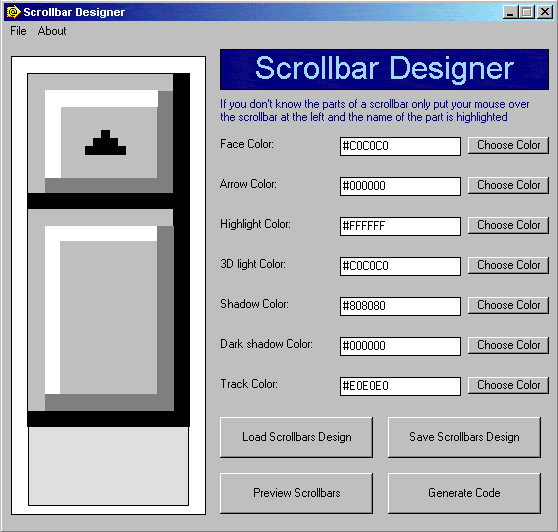



## Web Scrollbar Designer \- UPDATED

### Description

Here is the update for the Web Scrollbar Designer, same features, and a new was added, you can export your scrollbar design to a CSS or HTML file.

Please vote and leave your comments.
 
### More Info
 

             |
---                |---
**Submitted On**   |2002-09-06 00:29:04
**By**             |[Design7 Software](https://github.com/Planet-Source-Code/PSCIndex/blob/master/ByAuthor/design7-software.md)
**Level**          |Intermediate
**User Rating**    |4.7 (14 globes from 3 users)
**Compatibility**  |VB 5\.0, VB 6\.0
**Category**       |[Complete Applications](https://github.com/Planet-Source-Code/PSCIndex/blob/master/ByCategory/complete-applications__1-27.md)
**World**          |[Visual Basic](https://github.com/Planet-Source-Code/PSCIndex/blob/master/ByWorld/visual-basic.md)
**Archive File**   |[Web\_Scroll127449962002\.zip](https://github.com/Planet-Source-Code/design7-software-web-scrollbar-designer-updated__1-38698/archive/master.zip)

